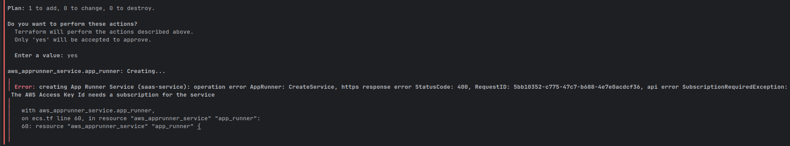

## **Issue: Terraform apply errors when creating App Runner configurations**

### The Problem:
Some people who have been using AWS and Terraform for a long time often resist using the UI, which might bring unexpected results when following instructions in a course or article. Today, while attempting to deploy via Terraform, the AWS API returned a `SubscriptionRequiredException (400)`. This error indicates that the account is not authorized to create new App Runner services.

Below is a detailed breakdown of the issue, the root cause, and the recommended solution to pivot to ECS Fargate, which is the more future-proof option given AWS's current direction with App Runner.

### Setup:
```
terraform git:(devel) ✗ terraform -v
Terraform v1.14.8
on linux_amd64
+ provider registry.terraform.io/hashicorp/aws v6.40.0
```

### Code:
```hcl
resource "aws_apprunner_service" "app_runner" {
  service_name = "saas-service"

  source_configuration {
    authentication_configuration {
      # This role needs "ecr:GetDownloadUrlForLayer" and "ecr:BatchGetImage"
      access_role_arn = aws_iam_role.infra_role.arn
    }

    image_repository {
      image_identifier      = "${aws_ecr_repository.app_repo.repository_url}:latest"
      image_repository_type = "ECR"
      image_configuration {
        port = "8000"

        # Secrets in App Runner are passed as environment variables referencing Secrets Manager
        runtime_environment_secrets = {
          CLERK_SECRET_KEY = "${aws_secretsmanager_secret.app_secrets.arn}:CLERK_SECRET_KEY::"
          CLERK_JWKS_URL   = "${aws_secretsmanager_secret.app_secrets.arn}:CLERK_JWKS_URL::"
          OPENAI_API_KEY   = "${aws_secretsmanager_secret.app_secrets.arn}:OPENAI_API_KEY::"
        }
      }
    }
    auto_deployments_enabled = true
  }

  instance_configuration {
    cpu               = "0.25 vCPU" # Equivalent to 256
    memory            = "0.5 GB"   # Equivalent to 512
    instance_role_arn = aws_iam_role.infra_role.arn
  }

  depends_on = [aws_iam_role_policy_attachment.infra_attach]
}
```

### Error Output:


### The Root Cause:
* **Service Transition:** AWS has begun the deprecation process for **AWS App Runner**. As of **April 30, 2026**, AWS has restricted new service subscriptions for accounts that were not already active users of the service.
* **Billing/Free Tier:** Unlike other compute services, App Runner is not included in the standard AWS Free Tier. While AWS credits *can* be used to pay for it, the API is currently blocking new resource creation for accounts without a pre-existing usage history.

### The Solution (Pivot to ECS Fargate):
Since App Runner is no longer an option for new on-demand projects, we should migrate our Terraform configuration to **Amazon ECS with Fargate**.

**Why ECS Fargate?**
* **Long-term support:** It is the primary successor to App Runner’s managed container model.
* **Free Tier eligible:** Unlike App Runner, Fargate has specific Free Tier allocations (first 50 hours/month).
* **Credit-friendly:** It fully supports AWS Promotional Credits.
* **On-demand:** It still allows for the same create-and-destroy workflow via Terraform.

### ECS Fargate vs. ECS Express:

ECS might be tempting due to its Express Mode, which abstracts away the ALB and networking, but it is not a direct replacement for App Runner. Express Mode is more of a quick start for simple applications, while standard ECS Fargate gives you full control over the infrastructure. However, if you plan to use custom domains, complex routing, or if you need more control over the load balancer, standard ECS Fargate is the better choice.

**Flexibility vs. Speed**

| Feature | ECS Fargate (Standard)                                      | ECS Express (Express Mode) |
| :--- |:------------------------------------------------------------| :--- |
| **Control** | Granular control over every ALB setting and listener rule.  | Highly opinionated; many settings are locked in. |
| **Custom Domains** | Manual setup via Route 53 and ACM.                          | Often uses auto-generated `*.on.aws` endpoints by default. |
| **Complexity** | High; requires a deep understanding of AWS networking.      | Low; designed for zero-config deployments. |
| **Use Case** | Complex microservices, custom routing, and enterprise apps. | Prototyping, small APIs, and developers who want to avoid VPC math. |

### Recommendations:
1.  **Discard App Runner code:** Use Express Mode for simple deployments, but if you want to use a custom domain, go with standard ECS Fargate for better control and future-proofing.
2.  **Remember when you deploy a ECS service:** you create several resource like: `aws_ecs_cluster`, `aws_ecs_task_definition`, and `aws_ecs_service`, even if they are not explicitly defined in your Terraform code, they are created under the hood by the AWS provider when you define an `aws_ecs_service` resource.
3.  **Maintain ECR:** You can keep the **Amazon ECR** repository, as both App Runner and ECS use the same image registry.
